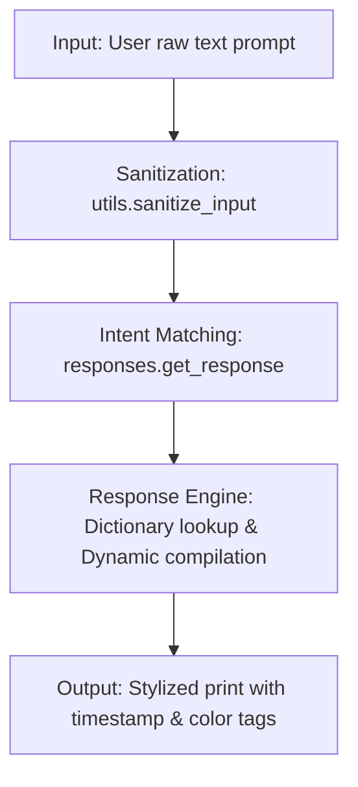

# Rule-Based AI Chatbot

A clean, professional, and realistic deterministic AI assistant designed and implemented during my AI Software Engineering Internship. This project demonstrates modular software design, robust input sanitization, deterministic pattern matching using dictionary/hashmap logic, and graceful console user interaction using standard Python libraries.

---

## 🌟 Project Overview
Modern generative AI relies on sophisticated neural networks, but deterministic, rule-based systems remain the fundamental guardrail layer for industry-grade conversational interfaces. This project simulates an AI assistant using **rule-based matching** instead of heavy machine learning libraries or external APIs. 

The chatbot operates on predefined intents, processing user inputs deterministically, executing dynamic tasks (like system clock fetches), supporting CLI overrides, and falling back gracefully when dealing with unknown queries.

---

## 🚀 Features
1. **Infinite Conversational Loop**: Keeps running continuously to sustain realistic back-and-forth dialogue until explicitly terminated.
2. **Robust Input Sanitization**: Automatically normalizes inputs (lowercase conversion, whitespace stripping) to increase matching reliability.
3. **Dictionary/Hashmap Intent Matching**: Performs dictionary lookups and keyword token checks to route user prompts cleanly, preventing deep and unscalable nested `if-elif` logic.
4. **Dynamic Context Resolution**: Resolves intents like `time` by executing system logic in real-time, rather than relying on static templates.
5. **Console Utility Overrides**: Supports terminal command overrides like `clear` to tidy the interface, `version` to review build logs, and `help` to show chatbot capabilities.
6. **Graceful Termination**: Handles standard exit commands (`exit`, `quit`, `bye`) and physical intercepts (like `Ctrl+C`) with polite farewell logs.
7. **Professional CLI Aesthetics**: Embeds an ASCII banner, distinct color indicators (using native ANSI escape codes), and precise timestamps `[HH:MM:SS]` for every exchange.
8. **Scalable Lexicon**: Supports at least 10 discrete intents spanning greetings, system diagnostics, project details, internship logs, jokes, thanks, and farewells.
9. **Conversational Variety**: Maintains a pool of distinct responses per intent, selecting them randomly to avoid repetitive, robotic phrasing.

---

## 🛠️ Technologies Used
- **Core Language**: Python 3.6+
- **Standard Libraries**:
  - `os` (Cross-platform console controls)
  - `sys` (Graceful execution termination)
  - `datetime` (Live timestamp logging)
  - `random` (Dynamic response selection)

*No external dependencies or third-party packages required!*

---

## 📁 Project Structure
The project is structured with high cohesion and loose coupling to represent proper software separation of concerns:

```
rule-based-ai-chatbot/
│
├── main.py             # Chatbot execution runtime and interface control loop
├── responses.py        # Keyword dictionaries, intent maps, and match logic
├── utils.py            # Input sanitization, CLI helpers, and ANSI styling
├── requirements.txt    # Build documentation (confirming zero pip dependencies)
├── .gitignore          # standard python-specific version-control rules
└── screenshots/        # Directory containing terminal runtime execution records
    └── .gitkeep        # Verification placeholder
```

---

## ⚙️ How It Works (The IPO Model)
The chatbot conforms to the classic **Input-Processing-Output (IPO)** design pattern. It operates as a straight pipeline from receipt of string to printing the final output:



### Flow Breakdown:
1. **Input**: User enters a string at the prompt.
2. **Sanitization**: The string is stripped of leading/trailing spaces and lowercased to resolve casing variations.
3. **Intent Matching**: The parser tokenizes the sanitized string and checks for matches against pre-defined keywords within the dictionary.
4. **Response Engine**:
   - If an intent matches (e.g. `greetings`), a response is chosen randomly from a response list.
   - If the intent requires dynamic logic (e.g. `time`), the system clock is queried to build a live response.
   - If no match is found, a randomized fallback response is selected.
5. **Output**: The output is wrapped in a dynamic clock prefix `[HH:MM:SS]` and formatted using terminal colors before being printed back.

---

## 💬 Example Conversation
Here is a simulation of the chatbot in operation:

```text
=============================================================================
  ____       _             ____                       _     _   ___  
 |  _ \ _  _| | ___       | __ )  __ _ ___  ___  __| |   / \ |_ _| 
 | |_) | | | | |/ _ \_____|  _ \ / _` / __|/ _ \/ _` |  / _ \ | |  
 |  _ <| |_| | |  __/_____| |_) | (_| \__ \  __/ (_| | / ___ \| |  
 |_| \_\\\\__,_|_|\___|      |____/ \__,_|___/\___|\__,_|/_/   \_\___| 
                                                                    
              --- Deterministic Rule-Based Assistant (v1.0) ---
=============================================================================
Type 'help' to view all system commands and capabilities.
Type 'clear' to clear the terminal window.
Type 'exit', 'quit', or 'bye' to safely exit the application.

[18:42:15] Bot: Online and ready. Let's talk!
-----------------------------------------------------------------------------
[18:42:20] You > hElLo ThErE!
[18:42:20] Bot: Hi there! Great to chat with you. How can I assist?
-----------------------------------------------------------------------------
[18:42:35] You > who built you?
[18:42:35] Bot: I was developed as part of an AI Software Engineering Internship project by a motivated student.
My goal is to demonstrate clean code, modular architecture, and deterministic input processing!
-----------------------------------------------------------------------------
[18:42:47] You > tell me a joke
[18:42:47] Bot: Why do programmers prefer dark mode? Because light attracts bugs! 🪲
-----------------------------------------------------------------------------
[18:42:55] You > check time
[18:42:55] Bot: The current system time is 06:42 PM on May 23, 2026.
-----------------------------------------------------------------------------
[18:43:08] You > exit
[18:43:08] Bot: Goodbye! Have a productive day ahead.

[System: Chatbot session closed successfully.]
```

---

## 📥 Installation & Setup
Since the chatbot only relies on the Python standard library, setting it up is instant:

1. **Clone or Download the Project**:
   Ensure you have all three core files (`main.py`, `responses.py`, and `utils.py`) in the same folder.
   
2. **Verify Python Installation**:
   Open a terminal (Powershell or Command Prompt on Windows, Terminal on macOS/Linux) and confirm Python is installed:
   ```bash
   python --version
   ```

---

## 🏃 How to Run
To run the interactive session:
```bash
python main.py
```

---

## 🎓 Internship Learning Outcomes
Developing this deterministic AI system built my competency in several engineering disciplines:
* **Separation of Concerns (SoC)**: Segmented the executable controller, utility wrappers, and lexicon models into individual files rather than building a single bloated script.
* **Deterministic Logic Mapping**: Explored tokenization and substring matching rules as a reliable, cost-effective alternative to generative LLMs for highly constrained domains.
* **Console Design**: Gained experience managing cross-platform compatibility (handling Linux/Mac vs Windows console clears) and terminal ANSI escape styles.
* **Defensive Coding & Graceful Interruption**: Handled Ctrl+C interrupts (`KeyboardInterrupt`) and general exceptions to prevent abrupt stack traces from ruining the user experience.

---

## 🔮 Future Improvements
If extended further, I would consider:
- [ ] Integrating a simple JSON-based logger to store conversation histories locally.
- [ ] Adding custom regex support for complex intent matches (e.g. tracking emails or phone numbers).
- [ ] Transitioning the vocabulary maps into an external configuration file (like `intents.json`) to isolate data from code.
